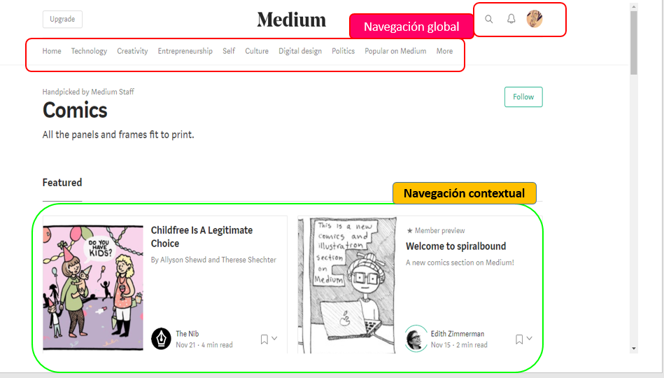

## Navegación :Breather-Github-Medium

En la pagina web de Breather encontraremos

1.-

2.-

3.-

4.-

## Navegación : Github
En la pagina web de Github encontraremos:
1.-

## Navegación ss: Medium
En la pagina web de Medium encontraremos:

1.-

2.-

